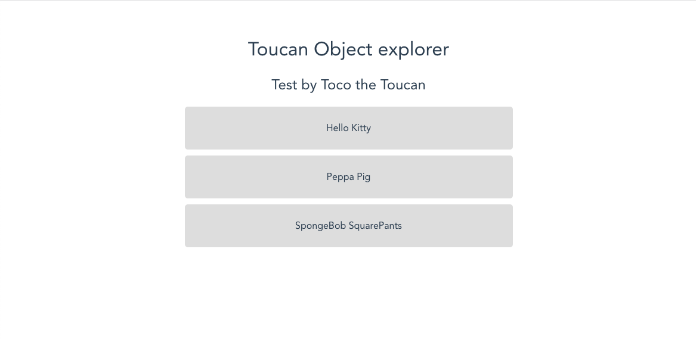
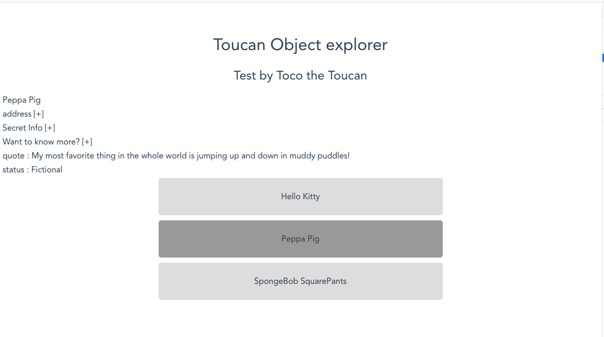
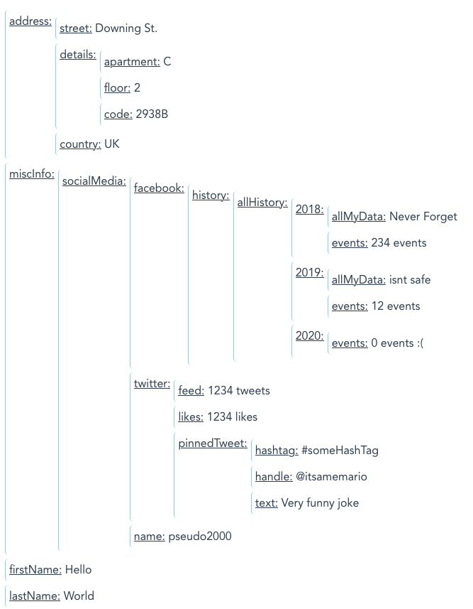

# vue-obj-explorer

> Welcome aspiring Tokar! This your first test to enter the front-end team.

## Build Setup

``` bash
# install dependencies
npm install

# serve with hot reload at localhost:8080
npm start

# build for production with minification
npm run build
```

For detailed explanation on how things work, consult the [docs for vue-loader](http://vuejs.github.io/vue-loader).

## Instructions

Create a fork of this repository to push your code to.

There are two parts to this test.
First you'll need to implement a simple view.
Then you'll need to create a component to display and modify objects with nested properties.

### 1. Display a list and some information (15-20min)

Go to `src/App.vue`

**Display a simple list**

Display the list of `people` and make it look like the image below:

<br>

<br>

by using either *CSS flexboxes or grids*.

> You don't need to make it pixel perfect, but it needs to be a centered list.

**Display more information**

Now we want to have more info on the characters listed.
When we click on a name in the list, the information (in `peopleInfo`) for this character should be displayed.

Some constraints:
- If a given info is a simple text, display it.
- If an info is a more complex object, just display a `[+]` next to the info category
- Display the full name of the character on top of the infos

As an indication, you should have something like this:
<br>

<br>

> You don't need to make the `[+]` signs clickable.

### 2. Display an object with nested properties (40min)

Uncomment the `<SecondPart />`

**Display any object with nested properties**

Checkout the SecondPart component and the `nestedObject`. 
You can see it in the textarea.

You must code a component that can display such a component as a tree, in a generic way.

To give you an idea, this is what the result can look like (it doesn't need to look too good, just readable :) )
<br>

<br>

**Make the object editable**

Now we want to be able to edit keys and values in this object.

1. First, make the values editable. Changes should be reflected in the object that is visible in the textarea.
2. Finally, make the keys editable

### Some more information

- Don't hesitate to ask questions during the test if you're stuck :)
- Feel free to use all online resources at your disposal
- If you think you won't finish everything in time, concentrate on having a working demo of the last step you finished.
